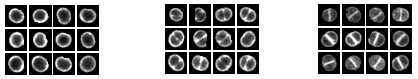

# Second Assignment

## Dates and rules

- submitted between November 25 and December 6
- **deadline December 6, 23:59**

You must submit a zip file containing, at least, these two files, named exactly as specified (names are case-sensitive):

* **TP2.txt**
    - This is the questions and answers file.
* **TP2.py**
    - This is a Python 3.x script that can be used to run your code for this assignment.

( Optionally, you can include other python modules if you wish to separate your code into several files. )

## Objective

The goal of this assignment is to examine a set of **bacterial cell images** using machine learning techniques, including **feature extraction**, **features selection** and **clustering**, in order to help the biologists organize similar images. In the folder `tp2_data`, you have a set of 563 PNG images (in the `images/` folder) taken from a super-resolution fluorescence microscopy photograph of Staphylococcus aureus, a common cause of hospital infections and often resistant to multiple antibiotics.

The images provided for this assignment were obtained by automatic segmentation and include cells in different stages of their life cicle as well as segmentation errors, not corresponding to real cells. The image below shows a sample of the images provided.


All images have the same dimensions, **50 by 50 pixels**, with a black background and the segmented region centered in the image. In this assignment, you will (1) **load all images**, (2) **extract features**, (3) **examine them** and (4) **select a subset for clustering** with the goal of reaching some conclusion about the **best way of grouping these images**.


## Implementation

In the **tp2_data** file provided there is a Python module, `tp2_aux.py`, with a function, `images_as_matrix()`, that returns a 2D numpy array with one image per row (563 rows) and one pixel per column (50x50=2500 columns) from the images in the `images` folder.

From this matrix, you will extract features using three different methods:

1) **Principal Component Analysis (PCA)** : Use the `PCA` class from the `sklearn.decomposition` module.

2) **t-Distributed Stochastic Neighbor Embedding (t-SNE)** : Use the `t-SNE` class from the `sklearn.manifold` module. When creating an object of this class, use the `method='exact'` argument, for otherwise the `t-SNE` constructor will use a faster, approximate, computation which allows for at most 3 components.

3) **Isometric mapping with Isomap** : Use the `Isomap` class from the `sklearn.manifold` module.

With each method, extract six features from the data set, for a total of 18 features.

In addition to the images, the `labels.txt` has information on the identification of the cell cycle phase for each cell. The first column has the cell identifier and the second column a label for the cell cycle phase. **These cells were manually labelled by biologists**. The figure below illustrates examples from the 3 phases, labelled with integers **1, 2 and 3**. The first phase before the cell starts to divide, the second covers the first part of the division, with the formation of a membrane ring where the cells will divide, and the third phase corresponds to the final stage of cell division. However, note that only some images are labelled. Images that were not labelled have a label value of 0 in this file.



After extracting features, select the best for clustering.

For this assignment, you will parametrize and compare at least two clustering algorithms: `DBSCAN` and `K-Means`. FIrst, for the DBSCAN algorithm, read the original paper on this algorithm and implement the parameter selection method described:

[A density-based algorithm for discovering clusters in large spatial databases with noise (1996). Martin Ester , Hans-Peter Kriegel , Jörg Sander , Xiaowei Xu](http://citeseerx.ist.psu.edu/viewdoc/download;jsessionid=5C53565C9C63080D7E5B8BBFBDCB28E3?doi=10.1.1.121.9220&rep=rep1&type=pdf) or you can find it in `./tp2_data/DBSCAN_paper.pdf`

The authors suggest a value of 4 for the minimum number of neighbouring points required for a point to be considered a core point. However, you should use a value of 5 as this is the default value in the Scikit-Learn implementation of DBSCAN. To implement the method to choose `ε` you will need to understand it, as described in the paper. This is part of the assignment.

In addition, examine the performance of each algorithm (`K-Means` and `DBSCAN`) by varying the main parameter of each one (**neighbourhood distance ε** and **number of clusters k**; you can leave the other parameters with their default values) and using an _internal index_, the _silhouette score_, and _external indexes_ computed from the labels available: the **Rand index**, **Precision**, **Recall**, the **F1 measure** and the **adjusted Rand index**. Note that the adjusted Rand index can be computed using the `adjusted_rand_score` function and the silhouette score using `silhouette_score`, both from `sklearn.metrics`.

Finally, select some parameter values for closer examination by visually inspecting the clusters generated. For this you can use the `report_clusters(ids, labels, report_file)` function in the `tp2_aux.py` module. Considering all the information gathered at this stage, recommend a procedure for the biologists that will help them process the segmented images, both for cell classification and to help discard segmentation errors.

## Optional exercise (for 2 points out of 20)

Implement the **bissecting K-Means hierarchical clustering algorithm**, as described in **lecture 19**. This can be done using the `KMeans classifier` available in the `Scikit-Learn` library to split each cluster into two sub-clusters with k = 2. Repeat this process by **splitting the cluster with the largest number of examples** in each iteration for a predetermined number of iterations. The output should be a list of lists, with each list corresponding to one example and listing all cluster labels to which the example was assigned, in order.

Here is an example of using **bissecting K-Means** for three iterations on five examples. The first example was placed on cluster of `index 1` in the first iteration, with the remainder on cluster of `index 0`. Then the third example was placed on sub-cluster of `index 1`, the other three on the sub-cluster of `index 0`. Of these, the second and fourth examples were placed in `sub-sub-cluster 0` ([0, 0, 0]) and the fifth example on `sub-sub-cluster` of `index 1` ([0, 0, 1]):

```{python}
[   [1 ],
    [0, 0, 0],
    [0, 1 ],
    [0, 0, 0],
    [0, 0, 1]   ]
```

If you want to examine the clusters generated after implementing the **bissecting K-Means** algorithm, you can use the function `report_clusters_hierarchical(ixs,label_lists,report_file)`. This function works similarly to the `report_clusters` function but expects the labels to be a list of lists as described above.

## Guidelines for the implementation

When testing different parameters for your clustering algorithms, note that the **silhouette** and **adjusted Rand scores** can only be computed if you have **at least 2 clusters**. If all data is placed in the same cluster the program will raise an exception.

The method for selecting the `ε` parameter recommended by the authors of `DBSCAN` consists in **plotting the sorted distance of each point to its fourth-nearest neighbour** and setting `ε` to the **distance corresponding to the “elbow”** in the plot. You can compute this plot using the `KNeighborsClassifier` to fit your data and then obtaining the distances matrix to the k-nearest neighbour with the kneighbors method. This classifier requires an `Y value` for the classes, but you can use a `vector filled with 0 or 1`, since you will not be using the classifier as such, only its kneighbors method in order to obtain the distance to the fourth neighbour. Check `Scikit-Learn documentation` for more details.

Numpy arrays have a `sort` method for sorting in place. This sorts the array from smallest to largest values, but you can invert any array by simply slicing it this way: `a = a[::-1]`.

The **feature extraction steps** in this assignment can **take a few minutes**. If you need to run your code many times for experiments it may be useful to save the extracted features to a file. A simple way of doing this is is to use the [`savez` and `load` functions in Numpy](https://docs.scipy.org/doc/numpy/reference/generated/numpy.savez.html).

To view your clusters, you can use the function `report_clusters(ids, labels, report_file)` available in the `tp2_aux.py` module. This function saves an `HTML file` with the clusters indicated by the labels argument. This `HTML file` assumes there is a folder `images/` with the images provided. The first argument is a `list or 1D array` with the **identifiers** for the images to show and the second argument is a `list or 1D array` with the **cluster labels** for the images, in the same order. The last argument is the **name of the html file** where the report will be saved. The file `example_labels.html` shows an example of a report (in this case created with the manual labels as clusters).

Read the questions carefully and give clear and concise answers. The main focus of this assignment should be the **selection of the best features** and a **discussion of the advantages and disadvantages** of each algorithm for this dataset, informed by an **analysis of their behaviour with different parameters and the different scores used**. For the `DBSCAN algorithm`, it is also important to discuss the adequacy of the method proposed by the authors for obtaining the value of `ε` in this particular case of clustering this cell images.
