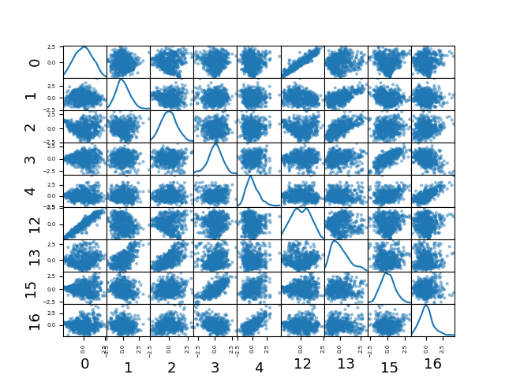

Attention:
- Do not edit this file in text editors like Word. Use a plain text editor only. In case of doubt, you can use Spyder as a text editor.
- Do not change the structure of this file. Just fill in your answers in the places provided (After the R#: tag).
- You can add lines in the spaces for your answers but your answers should be brief and straight to the point.
- You can include references to images or html files such as the reports generated with clusters. To do this, simply include this document in the folder with the reports or images and refer them in the text by the file name in an isolated line. For example, the line

refers to a test.png image file in the same folder as this document.

QUESTIONS:

# Q1: Explain how you selected the best attributes for the clustering phase. In particular, indicate the visualization methods used to explore the extracted attributes and any statistical tests used.
R1: 

After the standardization, we see at the correlation matrix:

We can see that the first sixt features represented in the 6x6 square in the top left are very uncorrelated between them, in fact they are the PCA trasformation of the space of the data, and the PCA axis are Linearly independent.
Also in the 6x6 square in the bottom rigth, representing the 6 features of the isomap, are very uncorrelated. One thing that we notice is that the middle 6 variables are a bit correlated between them; they correspond to the feature from the TSNE.
Now the important things that guided us to the following steps is that between the first 6 (PCA) features and the last 6 (Isomap) features we have a correlation that, in general, is bigger than 0.6.
So the PCA feature represent quite similar information about the data than Isomap; and in particular tye first 4 features of PCA and ISOMAP are highly correlated.
Than we decided to remove the features of ISOMAP that are correlated with the once from PCA. We could also do the opposite (remove features from PCA and let those from ISOMAP). 
We can see a scatter matrix plot of this features (only the oce highly correlated) in the following image:

and we see that when there is a correlation, the points plotted follow a diagonal line (with positive or negative orientation).

The last thing that we did is the Anova test with the H0 hypothesis of equality of the means vector for the different classes (in our case, clusters "0", "1", "2", "3").
With this test we select the p_values of every features (resulting from the univariate test on each feature at a time) and we calculate the critic value of the f distribution setting the right grade of freedom.
We reject the features that satisfies the test because those are the feature for which the mean vetor for different classes is the same, with high confidence (assuming alpha = 5%).
So that are no informative at all. The features for which the Anova Test fails, are the once we take, and we end up with 10 features.

In the steps of understanding the dataset and finding better features (because the clusters obtained are not good as our expectation) we did also Features clusterization on the initial pixel features (of size 2500).
We obtain nothing better than what we had in term of final k-means and DBSCAN clusters, but we understood that the central point of the cells images are very important, in fact (as we can see in the following picture)
we have 4 concentrical circles (and a bug features representing the background) where the middle expresses the big difference between the group 2 and the group 3.
We can see the cluster of features (with 5 attributes) in the following images, as well as the representation of 10 elements of each group and their representation in 5 features images.

In the zip are reported as fc_cluster_16.png and fc_confronted_16.png also the representation with 16 cluster of features. 
This last things were no useful for the results, but are still things necessary for better undertand the dataset.

# Q2: After selecting the attributes, did you standardize or normalize the values? Justify your decision.
R2: 

After selecting the attributes from the PCA, t-SNE and Isomap we make a test to evaluate what would be the best data transformation between standardization, normalization or max-min normalization. 
The test correspond to the train of 3 different linear SVM and a Anova test.
First we make an Anova test getting the f_score, converting it in "-log_10" scores and than normalizing the score to obtain a uniform sum (as probabilities).
Then we train 3 linear SVMs and get the weigths that correspond to each features, separately. Also in this case we normalize to obain a uniform sum.
The graph is the following:

The best option seems to be the standardization because of two factor: it puts "equal" empashys to each feature (it can be see in the graph), and it get better results in the Linear SVM model classifier (only on the 81 labeled images).
In fact we see:

* Classification accuracy row data: 0.810
* Classification accuracy after Normalization: 0.810
* Classification accuracy after Standardization: 0.857*
* Classification accuracy after MinMax norm: 0.810

*best solution

Standardization seems the best choice. In addition to that, we can also justify our decision of Standardization because by taking a look to the scatter plot we saw that exist outliers. 
When a dataset contains outliers is better to Standardize than to Normalize data because in the second case we put everything between 0 and 1 and with outliers the big part of the data goes very close each other in one extreme of the interval.

# Q3: Explain how you found the neighborhood radius value (epsilon) for the DBSCAN algorithm by following the procedure described in the article "A density-based algorithm for discovering clusters in large spatial databases with noise".
R3: 

Even if the suggestion of the teacher was to not check different features number when optimizing the epsilon parameter, we did it because it makes the esperiment more complete.
To find the epsilon for a specific number of features is necessary to calculate the distance between each point and the k-nearest neighbors (with k=5 as specified on sklearn). 
Once we have the 5 distances for each point, we select the fifth for each element (the biggest of the 5), and then sort the vector of the distances. Is needed, at this step, to plot the distances.
The next steps have to be done manually because we need to find the epsilon paramenter when this curve make a elbow. So for this is better to estract a range of distances.
What we did is to automatize the process by creating an interpolation function of order 15, and make the first derivative of this function (using numpy functions).
We tried also other order function but 15 is the best choice we found as the derivative of the function start oscillating when we reach the elbow, and then increases. Doing that and defining the last three local minimum as interval serching method, we are able to extract the epsilon range for every number of feature, in an automized method.

These are some examples:

Automated epsilon Params 

2 features

3 features

# Q4: Examining the clusters generated by the DBSCAN algorithm with the value optimized by the method described in the article, do you think the result is adequate to cluster these images? Justify your answer.
R4: 

DBSCAN does a great job of seeking areas in the data that have a high density of observations, versus areas of the data that are not very dense with observations.
We can easily understand that if our dataset is not composed as clusters of high density with some not high density as noise, our algorithm DBSCAN can't work.
Our dataset is not one of this case, in fact, also with the optimized parameter value of epsilon (and in our case, of the combination of epsilon and number of features), the results are still really bad: we cannot separate enough items. The reason for that is that the algorithm is not suitable with the problem. In fact when the number of features is too high, because the algorithm is based on radius distances, the course of dimensionality comes in order to complicate things and if the epsilon is too low every element is -1 "no cluster", and if it is too big every element is in only one cluster. That is what happen in the most of the case with our examples data, and just with few epsilon parameters we obtain a number of cluster different from "all no cluster" or "all in one cluster". In these cases the score values (refering to the external random index score) is very low, and it make us thing that these algorithm and these data are not made for each other.

# Q5: Describe your analysis of the k (for K-Means) and epsilon (for DBSCAN) parameters using the internal and external indicators referred in the assignment page. Include the two plots of the indicator values ​​(indicating the image name of each plot in one line in your answer) as a function of the k and epsilon parameters and explain how you chose the ranges for examining these parameters. Indicate, with justification, what conclusions you can draw from this analysis.
R5: 

The process of analysis of the epsilon value is explained above. Also, for our results the silhouette values wasn't suitable in this case.
Silhouette assumes convex clusters, but DBSCAN does not generate convex clusters. The sklearn implementation likely treats noise just like a cluster, which will usually give worse results. But Silhouette is not really meant to be used with noise labels. For that reason we didn't use it as internal index, and we didn't use any internal index at all. We used as external score the random index score, as the precision, recall and F1 scores result bad in all the DBSCAN clusters.

The plot for DBSCAN is the following (using external random index score):

External

For the k-means, we simply did a for loop with a k-value from 2 to a kmax collecting all the results for each indicator.
Then we select the best one for the internal indicator, and the best one for the external. The following plot represent kmeans external and internal scores varing the k value:

External

Internal

# Q6: Select some of the parameter values ​​tested in question five and examine the corresponding clusters more closely, generating the HTML file with the images. Explain how you selected these parameter values, discuss the different options and propose a recommendation that could help the biologists' task of classifying cells and rejecting segmentation errors.
R6: 

We generate the 2 html for the kmeans the results, choosing the k value accordingly to the best k we get with internal, and external indicators. There are differences, based on the number of cluster created, but the advantages for the biologist choosing one or the other will not be so different.
We can say that, comparing this 2 clustering results, usually the more the cluster the better the results: but in both cases the segmentation errors are in one-two clusters.

# Q7: Discuss advantages or problems with these two algorithms (K-Means and DBSCAN) for the purpose of helping biologists to organize these images, considering your theoretical knowledge of these algorithms as well as the results you obtained in your work.
R7: 

We think that DBSCAN is not suitable for this problem, because it works well in a scenario where the clusters are dense, well separated, with some noise, and also with different variances; in our case, the clusters aren't separate enough to let it work well, in no configuration.
If we use to much features, we incur in the curse of dimentionality problem. With few features the results are better, but still it seems that this algorithm is not able to understand the real cluster, for different reasons.
With small epsilon values, the clustered items are just few, and everything else is considered noise. With bigger epsilon values we get a huge cluster with most of the elements inside.
The k-means works better. Here we don't have the curse of dimentionality problem, and so we can get better values results using more features.
Though the results contain "mis-classification", this algorithm was able to put the segmentation errors in just one or two clusters.
We can see some similarity in the created clusters, and some clusters can be error-free (only in the case of complete-cell clusters), and so these can be a good help for the biologist, but they will still need to separate at least the separated-cells from the mid-separated (clusters 2 and 3).

# Q8: Consider other clustering algorithms embedded in the Scikit-Learn library. Choose one and apply it to this problem, optimizing the parameters you deem appropriate in the way that you find adequate. Justify your choices and discuss whether this option would yield more useful results for biologists.
R8: 

We tried AgglomerativeClustering and GaussianMixtures. The second seems to have better results in this scenario. We optimize the parameter that decide the number of mixture components. Also in this case (as such for k-means) we used internal and external scores in order to evaluate the best k value, and the following plots show the best k value according to these scores:

Agglomerative:

External

Internal

Gaussian Mixture:

External

Internal

Also with the best parameter, choosen accordingly to the internal and external indexes, the results wouldn't help the biologists.
If the choosen parameter is high enough (more then 5, 6) there could be some good clusters, but still too much noise (if we can say so, "mis-classification").

# Q9: (Optional) Implement the Bissecting K-Means hierarchical clustering algorithm as described in the assignment page and Lecture 19. Examine and discuss the results and their application to the problem of helping the biologists select and classify cell images.
R9: 

We haven't metrics to evaluate the Bissecting K-Means results, so we proceed by attempts. The results, looking at the html files, seem good. 
Selecting a number of clusters bigger then 3,4 we starts to get good result, also with just 3 features.
For instance (setting 3 features, and 6 clusters) we get 6 clusters with a nice intra-similarity, we have:
a cluster with an high percentage of garbage,
3 clusters without errors,
2 clusters with some errors.
So, the biologists can use this algorithm as a good help for selecting cells, they will just need to check few clusters, instead of each one.
